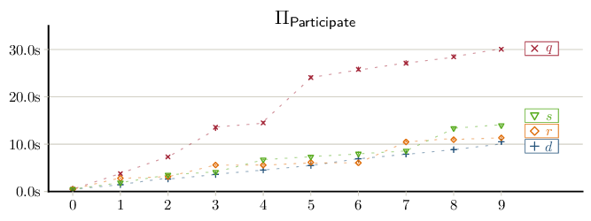

# Artifact Appendix

Paper title: **PrePaMS: Privacy-Preserving Participant Management System for Studies with Rewards and Prerequisites**

Artifacts HotCRP Id: **artifact25.1#6**

Requested Badge: **Reproduced**

## Description
In our paper we present a cryptographic scheme and a prototype implementation, which we used for a performance evaluation and public demo deployment.
This repository contains all source code artifacts, performance experiments, and results associated with our PETS'25 submission.
We implemented our PrePaMS system using modern web technologies to enable usage by participants on a variety of devices including mobile devices without the need to install a native application.

We opted to implement the cryptographic components of our PrePaMS scheme in Rust and compile it to WebAssembly for better performance and type safety, in contrast to a pure JavaScript implementation.
In order to assess the performance in real-world deployments, we opted to measure the performance of the scheme in a Browser environment instead of a better performing native execution.
We followed the [Popper convention](https://github.com/getpopper/popper) for reproducible evaluations.
Our evaluation uses a mostly automated docker-based setup that executes the experiments in a remote-controlled headless browser using [Puppeteer](https://github.com/puppeteer/puppeteer).

To put our system under load, we created a parametric workload generator.
The generator outputs a chronological sequence of valid interactions with the system (i.e., registrations, participations, payouts) that can be replayed for reproducible evaluation runs.
We defined suitable defaults and ranges for each parameter (i.e., distributions for each condition type) based on previous joint projects with psychology researchers to develop well-grounded workloads.
The replay phase is preceded by an initialization phase to bootstrap a set amount of studies with randomized preconditions.

The following commands are required to fully reproduce most results presented in our paper:
```bash
git clone --branch pets25.1 https://github.com/vs-uulm/prepams.git
cd prepams
EXPERIMENTS=scaling,performance WORKLOAD_SIZE=PETS25_FULL ./popper run
```

In the following we provide further details about the individual phases of our evaluation.

Our Popper workflow (see [`.popper.yml`](.popper.yml)) consists of two steps:
 * `measure` - Uses puppeteer to log the time it takes to execute the synthetic workload of PrePaMS operations.
 * `analyze` - Computes basic statistics on the time data collected in the previous step and generates a box plot.

### Security/Privacy Issues and Ethical Concerns (All badges)
The provided artifacts should not yield any security or privacy risks for reviewers.
The provided evaluation script will fetch pre-built docker images from GitHub's container registry.
Once fetched the execution will not require any network access or connect to remote services.
Alternatively, the docker images can also be built manually, although this process also requires fetching packages from external repositories.

## Basic Requirements (Only for Functional and Reproduced badges)

### Hardware Requirements

No specific hardware is required to reproduce the evaluation results.
Any reasonably modern desktop computer with a 64-bit Linux and at least 2GB of RAM.
The artifacts have been successfully tested and reproduced using the provided "Docker pre-installed (4 cores, 16GB memory, 40GB Disk, Ubuntu 22.04)" VM variant.

### Software Requirements
Our artifacts only require [Docker](https://www.docker.com/get-started/) and [Popper](https://github.com/getpopper/popper) (a tool for reproducible system evaluations), while the latter also runs as a docker container with an optionally installable wrapper script.
We tested the artifacts using Ubuntu 22.04 LTS running on a x64 architecture as well as the "Docker pre-installed (4 cores, 16GB memory, 40GB Disk, Ubuntu 22.04)" VM variant.
Although not tested, other Linux distributions should work as well.

### Estimated Time and Storage Consumption

The fully reproduce our results used in our PETS'25 paper (`PETS25_FULL`), an execution time of about 12 hours has to be expected, depending on the performance of the evaluation machine. 
By default the `PETS25_REDUCED` configuration is used, which skips the majority of repetitions, to provide a faster execution of about 1 hour with comparable results.
We additionally provide a minimal workload `PETS25_MINIMAL`, which can be used to test the functionality of the environment.

```
PETS25_MINIMAL   ~13 minutes
PETS25_REDUCED    ~1 hour
PETS25_FULL      ~21 hours
```

The workload size can be configured using the `WORKLOAD_SIZE` environment variable.
For example, `WORKLOAD_SIZE=PETS25_FULL popper run` can be used to run our full PETS'25 evaluation.

During execution the total RAM usage of the running docker containers should not exceed 1GB.
All docker PrePaMS docker images take up about 9GB of disk space, although only 3 images are required for replicating the evaluation, which require 6GB of disk space:

```
 ghcr.io/vs-uulm/prepams/frontend        110MB
 ghcr.io/vs-uulm/prepams/backend         1.79GB
 ghcr.io/vs-uulm/prepams/survey          1.1GB
 ghcr.io/vs-uulm/prepams/shared          1.93MB
 ghcr.io/vs-uulm/prepams/evaluation      2.22GB
 ghcr.io/vs-uulm/prepams/verse           3.43GB
```

## Environment 

### Accessibility (All badges)

All artifacts are available in a public GitHub repository (https://github.com/vs-uulm/prepams/tree/pets25.1) tagged with `pets25.1`.
Furthermore, prebuilt docker images are available via the public GitHub container registry.


### Set up the environment (Only for Functional and Reproduced badges)
The repository can be checked out using the following shell command or by downloading a [ZIP-archive from GitHub](https://github.com/vs-uulm/prepams/archive/refs/tags/pets25.1.zip).
```bash
git clone --branch pets25.1 https://github.com/vs-uulm/prepams.git
```

The main dependency to use our artifacts is [Docker](https://www.docker.com/get-started/) and is typically installed using the operating system's package manager.
Additionally, we use [Popper](https://github.com/getpopper/popper), a tool for reproducible system evaluations, to instrument the evaluation.
It can either be installed following the instructions listed in the [Documentation](https://popper.readthedocs.io/en/latest/sections/getting_started.html).
Alternatively, we packaged a helper script ([`./popper`](./popper)), which provides the same functionality without installing popper.
To use the helper script, simply replace any call of `popper` with a relative call of the helper script `./popper`.

The docker images are typically automatically pulled, when running the evaluation using `popper` or when deploying using `docker compose`.

### Testing the Environment (Only for Functional and Reproduced badges)
A minimal functionality test can be executed by running the following command:
```bash
WORKLOAD_SIZE=PETS25_MINIMAL popper run
```

When prompted for the `EXPERIMENT`, simply press enter to use the default of running all experiments.

This will download the required docker images and execute our evaluation pipeline with a minimal workload.
The total runtime is less than 2 minutes plus the time it takes to download the docker images from the GitHub Container Registry.

## Artifact Evaluation (Only for Functional and Reproduced badges)

### Main Results and Claims

The following results were obtained by running the evaluation on a desktop computer with an Intel Core i7-7700 (quad-core with SMT; 3.60 GHz) CPU and 32 GB RAM, running Ubuntu 22.04 LTS (GNU/Linux 5.4.0) with a headless Chrome 108.
Additionally, we used a semi-automated build of the evaluation to evaluate the performance on different end-user devices, more precisely, an Android smartphone (Pixel 6 w/ Android 14 and Chrome 121) and an Apple tablet (3rd Gen iPad Pro 11” w/ iPadOS 17.2 and Safari 172).

#### Main Result 1: Performance of User Operations under Realistic Conditions

For the first evaluation, we claim that the processing times are short enough to allow use in a real environment.

The execution times of the register, participate, and payout procedures are depicted in Figure 1.
All participant measurements were executed separately using three different types of end-user devices (i.e.,  desktop,  tablet, and  smartphone).

Across devices the mean execution time of the registration procedure was $71.5 ms$ ($\sigma=28.6 ms$).
The cost of the participation procedures highly depends on the number of prerequisites of the respective study.
For our workload, this resulted in a mean participation time of $624.0 ms$ ($\sigma=529.0 ms$) with a mean proof size of $7.1 kB$ ($\sigma=2.6 kB$).
The execution time of the payout protocol is constant, depending only on the fixed number of maximum inputs, in our case, 10 study rewards.
This resulted in a mean execution time of $8.4 s$ ($\sigma=5.2 s$) with a mean payload size of $18.8 kB$ ($\sigma=4.1 B$).

The average execution times on the service side for registration was $48.1 ms$ ($\sigma=4.25 ms$), rewards issuance took an average of $26.0 ms$ ($\sigma=2.84 ms$), and payout validation was performed in $1.4 s$ ($\sigma=61.3 ms$) on average.

> 
>
> **Figure 1:** Combined violin/jitter plots of measured execution
times (in seconds) of our PrePaMS proof of concept implementation based on a synthetic workload with 𝑁 = 1000 participants, 𝑀 = 1000 participations, and 𝑂 = 100 payouts.
> The individual protocols are segmented by the role of the executing party (P: Participant, O: Organizer, S Service) and partially replicated across different device types (i.e., 
>  desktop,
>  tablet,
> and  smartphone).

The raw data from this experiment is also supplied in [`./results/performance`](./results/performance) and [`./results/browser`](./results/browser).

#### Main Result 2: Computational Impact of Prerequisite Complexity

In the second evaluation, we illustrate that (dis-)qualifiers have a considerable impact on the computation time, but still allow the use of more complex preconditions in a reasonable execution time.

The results (see Figure 2) indicate a mostly linear scaling with an increasing number of (dis-)qualifiers with an exponential offset in irregular intervals.
This step-wise increase in computation time can be accounted for by the vector width of the inner product proof being padded to the next power of two.
Each prerequisite type requires a different amount of group elements to be encoded in the inner product proof, yielding a different scaling behavior.
Quantitative empirical studies require a minimum sample size to achieve statistically significant results.
However, combining numerous prerequisites can make it difficult to recruit enough participants and thus impossible to achieve these sample sizes.
For this reason, the number of prerequisites for psychological studies is usually in the lower single-digit range, which is also the cardinality our evaluation is grounded on.
The results indicate that the scheme is also applicable for studies with non-trivial requirements that include multiple prerequisites.

> 
>
> **Figure 2:** Plot of measured median execution times in seconds of the participation protocol based on a synthetic workload with either <span style="color: #a32638;">qualifier (×, 𝑞)</span>, <span style="color: #26547c;">disqualifier (+, 𝑑)</span>, <span style="color: #bd6005;">range constraints (⋄, 𝑟)</span>, or <span style="color: #56aa1c;">set constraints (▽, 𝑠)</span> varied from 𝑛 ∈ [0..10] and all other parameters pinned to 0.

The raw data from this experiment is also supplied in [`./results/`](./results/) in the `qualifier-{0..9}`, `disqualifier-{0..9}`, `range-constraint-{0..9}`, and `set-constraint-{0..9}` subdirectories.

### Experiments 

#### Experiment 1: Performance of User Operations under Realistic Conditions

In this evaluation, we assessed the performance to be expected when users interact with our system.
More precisely, we measured the execution times of three crucial operations (i.e., register, participate, and payout) based on actual end-user devices.

To run this experiment call `popper run measure`, if you only want to execute this experiment and not the other experiments you can set the environment variable `EXPERIMENT=performance` when calling popper:

```bash
EXPERIMENT=performance popper run measure
```

During execution the protocols are executed for varying studies and participants and the recorded runtimes are written to csv files as follows:

```
evaluation
└── results
    └── performance
        ├── participations.csv
        ├── payout.csv
        ├── register.csv
        ├── WARMUP_participations.csv
        ├── WARMUP_payout.csv
        └── WARMUP_register.csv
```

Running `popper run analyze` afterwards will produce a plot of the collected data and saved as `evaluation/results/performance.pdf` (see Figure 1).

#### Experiment 2: Computational Impact of Prerequisite Complexity

In this evaluation, we wanted to assess the usage of varying amounts of different prerequisites in studies.
We wanted to check whether the computational costs are reasonable enough to put our approach into practice.

To run this experiment call `popper run measure`, if you only want to execute this experiment and not the other experiments you can set the environment variable `EXPERIMENT=scaling` when calling popper:

```bash
EXPERIMENT=scaling popper run measure
```

During execution the participation protocol is executed with varying prerequisites and the recorded runtimes are written to csv files as follows:

```
evaluation
└── results
    ├── disqualifier-{0..9}
    │   └── participations.csv
    ├── qualifier-{0..9}
    │   └── participations.csv
    ├── range-constraint-{0..9}
    │   └── participations.csv
    └── set-constraint-{0..9}
        └── participations.csv
```

Running `popper run analyze` afterwards will produce a plot of the collected data and saved as `evaluation/results/scaling.pdf` (see Figure 2).

## Limitations (Only for Functional and Reproduced badges)

The provided artifacts allow to reproduce all results presented in our paper, although the evaluation with mobile devices requires additional steps as described below and are disabled by default.
The experiment workflow in the `.popper.yml` file provides an additional step, which starts an evaluation web server and on port `52716`.
To enable this server, the `.popper.yml` file has to be edited, and the following line has to be removed:
```yaml
    SKIP_STEP: "REMOVE THIS LINE TO ENABLE THE EVALUATION SERVER"
```

The server can then be started by executing this step, by e.g., running `popper run additional_devices`.
While the server is running, any device can be evaluated by opening the website served by the evaluation server in a web browser (c.f., https://prepams.uni-ulm.de/eval).
This presents a simple web interface to execute a single or all measurements.
It is advised to have the device plugged into a charger to prevent the battery running out, and disabling any screen timeouts.
The results are both presented on the device with an option to copy them to the clipboard, as well as automatically uploaded back to the evaluation server, where they will then automatically be picked up by the `analyze` step.

Some APIs used in the web applications may only be available in a secure context (i.e., via HTTPS).
This may require additional setup using a reverse proxy, such as nginx or traefik.

Alternatively, our public test setup can also be used to evaluate additional devices.
Simply navigate to https://prepams.uni-ulm.de/eval and click on the "run performance" link.
The "Download ZIP Archive" button enables you to download the results as a ZIP archive.
Extract the downloaded archive to the [`./evaluation/results/browser/`](./evaluation/results/browser/) directory, to end up with the following directory structure:

```
evaluation
└── results
    └── browser
        ├── Android-10_Chrome-121000_mobile
        │   └── performance
        │       ├── participations.csv
        │       ├── payout.csv
        │       ├── register.csv
        │       ├── WARMUP_participations.csv
        │       ├── WARMUP_payout.csv
        │       └── WARMUP_register.csv
        └── MacOS-10157_Safari-172_tablet
            └── performance
                ├── participations.csv
                ├── payout.csv
                ├── register.csv
                ├── WARMUP_participations.csv
                ├── WARMUP_payout.csv
                └── WARMUP_register.csv
```

You can then proceed by running `popper run analyze` to update the generated plots.

*Note: Only the performance experiment data is used to generate the runtime plots. The scaling measurements can be measured on other browsers as well, but are currently not automatically used in the graphical results.*

## Notes on Reusability (Only for Functional and Reproduced badges)

Does not apply.
