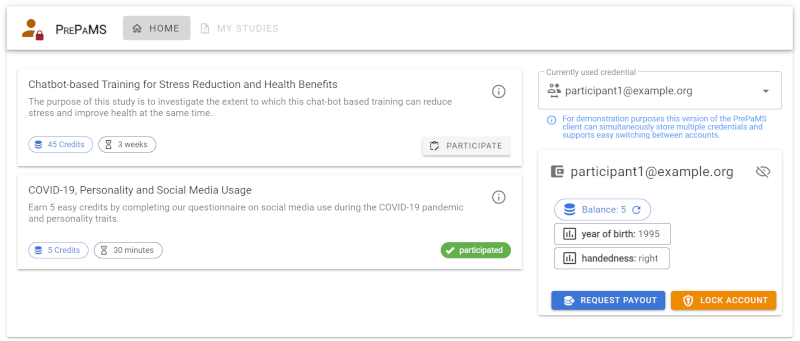
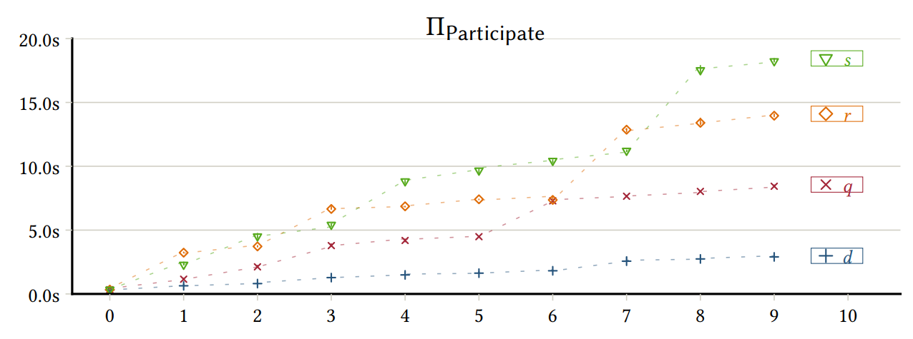

# PrePaMS: Privacy-preserving Participant Management System

This repository contains source code artifacts, experiments, and results associated with our PETS'25 paper.
A publicly hosted test deployment can be accessed at https://prepams.uni-ulm.de, where anyone is able to explore our system using any device featuring a modern web browser.

More details about our constructions, prototype, and evaluation can be found in our PETS'25 publication:
> Echo Meißner, Frank Kargl, Benjamin Erb, Felix Engelmann. 2025. *PrePaMS: Privacy-Preserving Participant Management System for Studies with Rewards and Prerequisites.* In Proceedings on Privacy Enhancing Technologies 2025 (1), 632–653. https://doi.org/10.56553/popets-2025-0034

## Repository Structure
 * [`shared/`](shared) - a rust-based WebAssembly module implementing the PrePaMS protocol.
 * [`backend/`](backend) - the PrePaMS server application that exposes an HTTP-based API for the PrePaMS web application.
 * [`frontend/`](frontend) - the main client-side source code of the PrePaMS web application.
 * [`evaluation/`](evaluation) - evaluation artifacts to reproduce our performance evluation results (see [Evaluation](#evaluation)).
 * [`results/`](results) - our evaluation results as reported in our paper.
 * [`survey/`](survey) - a very simple web-based survey system to showcase online studies.

## Abstract
> Taking part in surveys, experiments, and studies is often compensated by rewards to increase the number of participants and encourage attendance.
> While privacy requirements are usually considered for participation, privacy aspects of the reward procedure are mostly ignored.
> To this end, we introduce PrePaMS, an efficient participation management system that supports prerequisite checks and participation rewards in a privacy-preserving way.
> Our system organizes participations with potential (dis-)qualifying dependencies and enables secure reward payoffs.
> By leveraging a set of proven cryptographic primitives and mechanisms such as anonymous credentials and zero-knowledge proofs, participations are protected so that service providers and organizers cannot derive the identity of participants even within the reward process.
> In this paper, we have designed and implemented a prototype of PrePaMS to show its effectiveness and evaluated its performance under realistic workloads.
> PrePaMS covers the information whether subjects have participated in surveys, experiments, or studies.
> When combined with other secure solutions for the actual data collection within these events, PrePaMS can represent a cornerstone for more privacy-preserving empirical research.
>
> 

## Evaluation
To assess the practicability of our proof-of-concept prototype, we have evaluated the performance of the PrePaMS primitives.
The evaluation in this repository follows the [Popper convention](https://github.com/getpopper/popper) for reproducible evaluations.

The following results were obtained by running the evaluation on a desktop computer with an Intel Core i7-7700 (quad-core with SMT; 3.60 GHz) CPU and 32 GB RAM, running Ubuntu 22.04 LTS (GNU/Linux 5.4.0) with a headless Chrome 108.
Additionally, we used a semi-automated build of the evaluation to evaluate the performance on different end-user devices, more precisely, an Android smartphone (Pixel 6 w/ Android 14 and Chrome 121) and an Apple tablet (3rd Gen iPad Pro 11” w/ iPadOS 17.2 and Safari 172).

> 
>
> **Figure 1:** Combined violin/jitter plots of measured execution
times (in seconds) of our PrePaMS proof of concept implementation based on a synthetic workload with 𝑁 = 1000 participants, 𝑀 = 1000 participations, and 𝑂 = 100 payouts.
> The individual protocols are segmented by the role of the executing party (P: Participant, O: Organizer, S Service) and partially replicated across different device types (i.e., 
>  desktop,
>  tablet,
> and  smartphone).

> 
>
> **Figure 2:** Plot of measured median execution times in seconds of the participation protocol based on a synthetic workload with either qualifier (×, 𝑞), disqualifier (+, 𝑑), range constraints (⋄, 𝑟), or set constraints (▽, 𝑠) varied from 𝑛 ∈ [0..10] and all other parameters pinned to 0.

### Reproducing Results
The Popper workflow in this repository can be used to replicate results, compute statistics, and generate plots from the evaluation results.
Assuming both [Docker](https://www.docker.com/) and the [Popper CLI tool](https://github.com/getpopper/popper) are installed, you can simply call `popper run` in the root directory of the repository to run the workflow.
In case the Popper CLI tool is not installed, you can alternatively use the provided [`./popper.sh`](./popper.sh) helper script, which executes the Popper CLI in a docker container.
The evaluation artifacts have only been tested on 64-bit Linux systems, other operating systems or architectures may require additional steps.

Our Popper workflow (see [`.popper.yml`](.popper.yml)) consists of two steps:
 * `measure` - Uses puppeteer to log the time it takes to execute the synthetic workload of PrePaMS operations.
 * `analyze` - Computes basic statistics on the time data collected in the previous step and generates a box plot.

Post execution the [`evaluation/results/`](results) directory will contain the following files:
 * `performance/register.csv` - Measurements of the register protocol.
 * `performance/participations.csv` - Measurements of the participation protocol.
 * `performance/payout.csv` - Measurements of the payout protocol.
 * `performance.pdf` - A violin plot showing the processing times of the measured algorithms.
 * `{qualifier,disqualifier,set-constraints,range-constraints}-%d/participations.csv` - Measurements of the participation protocol with varying prerequisites.
 * `scaling.pdf` - A min/max linechart showing the processing time of the participation protocol in relation to the number of qualifier,disqualifier, and attribute constraints.

### Measuring other Devices

The [`evaluation/`](evaluation/) directory also contains means to measure other devices, such as smartphones or tablets.
This step is skipped by default during evaluation using `popper`.
To enable it remove the `SKIP_STEP: "REMOVE THIS LINE TO ENABLE THE EVALUATION SERVER"` line from the [`.popper.yml`](./.popper.yml) file.

Alternatively, executing `npm run build` [`evaluation/`](evaluation/) in the evaluation directory compiles a static version of the performance evaluation and outputs it to the `evaluation/dist` directory.
Then [`evaluation/serve.js`](evaluation/serve.js) can be used to run a simple web server which hosts this static evaluation app, as well as an HTTP-based API to retrieve measurement results from other devices.
A ready to use version is deployed under [https://prepams.uni-ulm.de/eval/](https://prepams.uni-ulm.de/eval/), ready to evaluate the performance of PrePaMS on any device featuring a modern browser.

`popper run analyze` can be used to update the resulting plot `scaling.pdf` with the additional devices.

## License
The PrePaMS prototype and related artifacts are licensed under the terms of the [AGPL-3.0 license](./LICENSE.md), unless otherwise noted.

